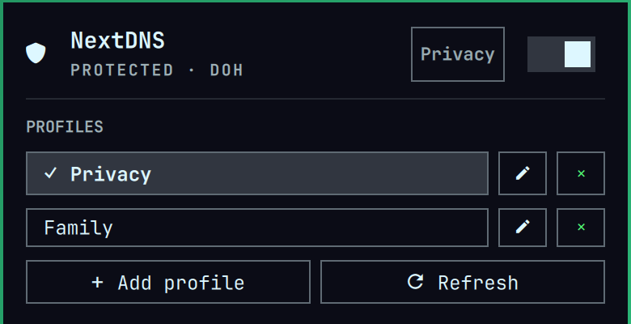

# NextDNS Control for Omarchy

A native Omarchy bar widget for the NextDNS CLI. It shows whether NextDNS is active, opens a detail panel, switches profiles, and turns NextDNS on or off.



## What it does

- Reads state with the fixed `/usr/bin/nextdns` CLI after verifying that it belongs to the installed `nextdns` package and neither it nor its parent directories are group- or world-writable.
- Activates or deactivates NextDNS through a graphical authorization prompt.
- Changes the configured profile and restarts the service.
- Adds, edits, and removes up to 32 named profiles directly in the panel.
- Detects a missing CLI and offers to open the Omarchy AUR installation command in a terminal.
- Stores profile names and IDs in the local Omarchy bar configuration. The repository contains no profile IDs or NextDNS credentials.

Installing the Omarchy plugin itself does not install packages or run setup commands.

## Installation

Add and enable the plugin from its public GitHub repository:

```sh
omarchy plugin add https://github.com/bitshaker/nextdns-omarchy.git --enable
```

The plugin does not install packages or modify NextDNS until you explicitly choose an action. If the CLI is missing, install it from the panel or run:

```sh
omarchy pkg aur add nextdns
```

## Requirements

- Omarchy 4 with the Quattro shell plugin system.
- The NextDNS CLI from the AUR (`nextdns`).
- A working graphical polkit agent. Omarchy provides one through its shell.

If the CLI is installed but not configured, entering a profile ID and choosing **Configure** runs the workstation setup with client reporting and automatic activation.

## Validation

The plugin ID is `bitshaker.nextdns-omarchy`. Validate it from the repository root:

```sh
omarchy plugin validate .
qmllint -I "$OMARCHY_PATH/shell" BarWidget.qml Panel.qml NextDnsService.qml
```

## Controls

- Left click: open or close the panel.
- Right click: turn NextDNS on or off.
- Middle click: refresh status.
- Panel switch: turn NextDNS on or off.
- Profile button: change profile and restart NextDNS in one privileged transaction and with one authorization prompt. If the change or restart fails, the previous profile is restored and restarted automatically.

Turning NextDNS off means **system DNS**. The resolver selected by the operating system may be the network DNS or a configured fallback; the plugin does not label it as a particular NextDNS profile.

## Profiles

Use **Add profile** beside **Refresh** to reveal the name and ID fields below the saved-profile list. Use the pencil button to edit an entry and the × button to remove it from the list. The editor stays collapsed until requested. Removing an entry does not delete the profile from NextDNS or change the currently active profile. Profile IDs are the six lowercase hexadecimal characters shown on the NextDNS Setup page and are not API keys. The plugin stores at most 32 profiles, and names are limited to 80 plain-text characters.

## Security

Read-only status commands run as the desktop user. All executable paths are fixed. Before use, the plugin verifies `/usr/bin/nextdns` belongs to the installed `nextdns` package; `/`, `/usr`, `/usr/bin`, and the executable are owned by UID 0 and are not group- or world-writable; and the exact executable path is a regular executable rather than a symlink. Mutating commands use fixed absolute executable paths under `pkexec`; no password is stored and user-supplied profile IDs must match `^[0-9a-f]{6}$`. A profile switch runs set, restart, and any required rollback inside one sanitized, fixed-script transaction with the validated IDs passed only as positional arguments, so it needs one authorization prompt. Every process has a deadline and bounded streaming output; displayed output is capped, stripped of control/bidirectional formatting characters, and rendered as plain text. Package installation runs only after the user presses the install button and remains visible in a terminal.

The NextDNS CLI does not provide an atomic configure-and-restart command, and its systemd service does not support reload. Changing a profile therefore requires separate `nextdns config set` and `nextdns restart` operations. The plugin executes those operations within the single privileged transaction described above so that it can restore and restart the previous profile if either operation fails.

## Removal

Removing this bar plugin does not uninstall or deactivate NextDNS:

```sh
omarchy plugin remove bitshaker.nextdns-omarchy
```

Manage or uninstall the CLI separately if desired.
